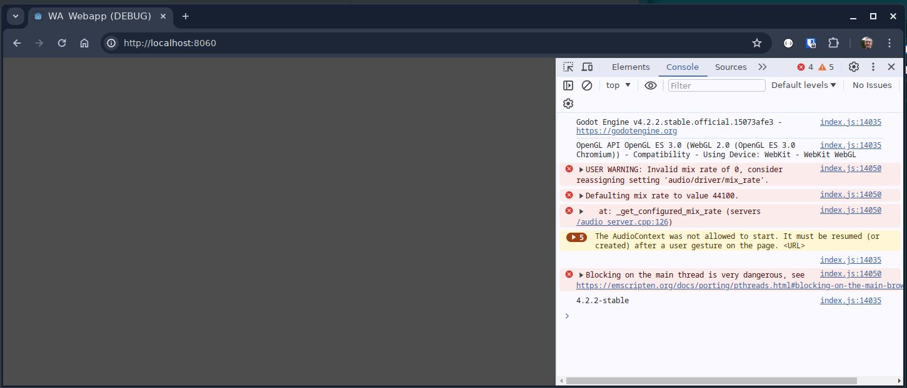
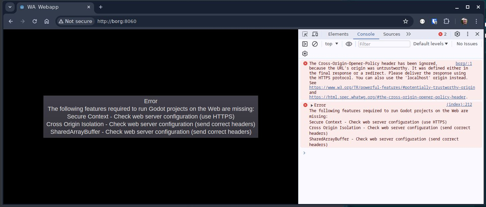

# Godot WebAccess

Example project to show how to run a Godot webapp in your browser and access remote APIs.

Based on the instructions from the Godot manual (https://docs.godotengine.org/en/stable/tutorials/networking/http_request_class.html),
with modifications where necessary.

## Structure
There's three Godot projects: one Webapp (the "client"), a webapp server, and an "external" server. The "external"
server is an example server that provides an API. The Webapp is hosted via the webapp server, and is configured in such
a way that it can run in any browser, and still be able to call the "external" API (typically this is prevented because
of CORS policies in the browser, so we need to find a solution that allows requests from our webapp to reach the 
"external" API).

## CORS restrictions
To be able to call an API that is hosted on another server as the webapp host, the browser needs to receive instructions
that calls to the "external" API are allowed. These instructions have to come from the "external" domain, by providing
an `Access-Control-Allow-Origin` header (ACAO) in the response to a `GET` request that includes an `Origin`  header
The `Origin` must match one of the ACAO values.

This can be done easily if one controls the "external" API (the ACAO headers can be added to the server), but if the
webapp is supposed to call APIs that are not under our control, the ACAO header will not match.

### Example - calling github API
A simple call to the github API that is done as soon as the application starts:
```
extends Node

func _ready():
	$HTTPRequest.request_completed.connect(_on_request_completed)
	$HTTPRequest.request("https://api.github.com/repos/godotengine/godot/releases/latest")

func _on_request_completed(result, response_code, headers, body):
	var json = JSON.parse_string(body.get_string_from_utf8())
	print(json["name"])

```
After exporting the project to HTML5 and running it with the `serve.py` provided by Godot, the results are as follows:

* http://localhost:8060
  * 
* http://borg:8060 (borg being the name of my PC)
  * 

### Solving the CORS problem
Typically, we want to call APIs that are not directly in our control, so we will not be able to get the API equipped
with the correct CORS headers.

To work around the CORS restrictions, we leverage the server that hosts our webapp as an intermediary. Since that 
server is not running in a browser, it is not restricted by CORS policies. The webapp (in the browser) calls the server
where it is hosted (this is the Same Origin, so API calls are allowed in the browser), and that server will call the 
"external" API, passing the result back to the webapp in the browser.

### Another snag: Secure Context needed (ergo: https)
The HTTP Server(s) need to use HTTPS in order for the browser (where the webapp runs) to allow it to run the Godot
application. The initial solution uses godottpd, which has no support for HTTPS.

A Reddit post and one of its comments points to a possible solution (https://www.reddit.com/r/godot/comments/17ltxjp/comment/l1uz70s)


## License

This work is licensed under CC BY-SA 4.0 (https://creativecommons.org/licenses/by-sa/4.0/), except for the
following resources:
* `remote_api/addons/godottpd` and `server/addons/godottpd`  
  * based on https://github.com/deep-entertainment/godottpd
  * MIT - see server/addons/godottpd/LICENSE

(C) CC BY-SA 4.0, 2024 Jean-Marc van Leerdam <j.m.van.leerdam@gmail.com>
